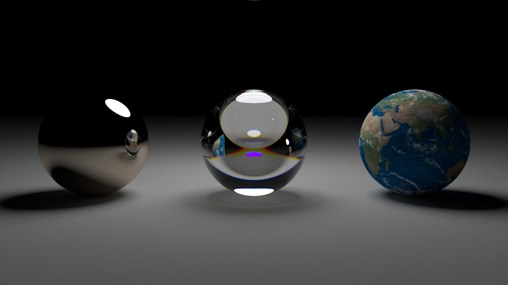
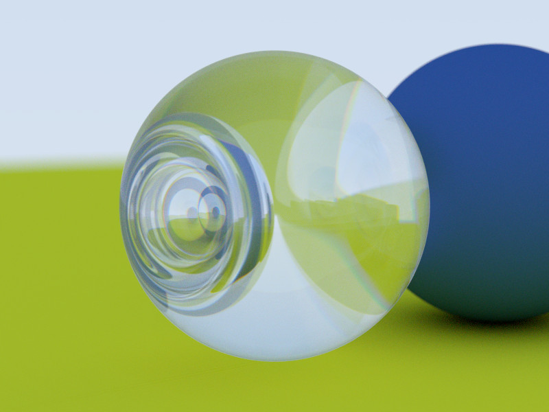

A simple spectral raytracer. The structure is mostly based on the great book series [Ray Tracind in One Weekend](https://raytracing.github.io/books/RayTracingInOneWeekend.html).
I extended on this by using spectral rays instead for some nice caustic effects.

Conversion from RGB textures to spectral colors is done by estimating the distribution as described in [An RGB to Spectrum Conversion for
Reflectances](http://citeseerx.ist.psu.edu/viewdoc/download?doi=10.1.1.40.9608&rep=rep1&type=pdf).

